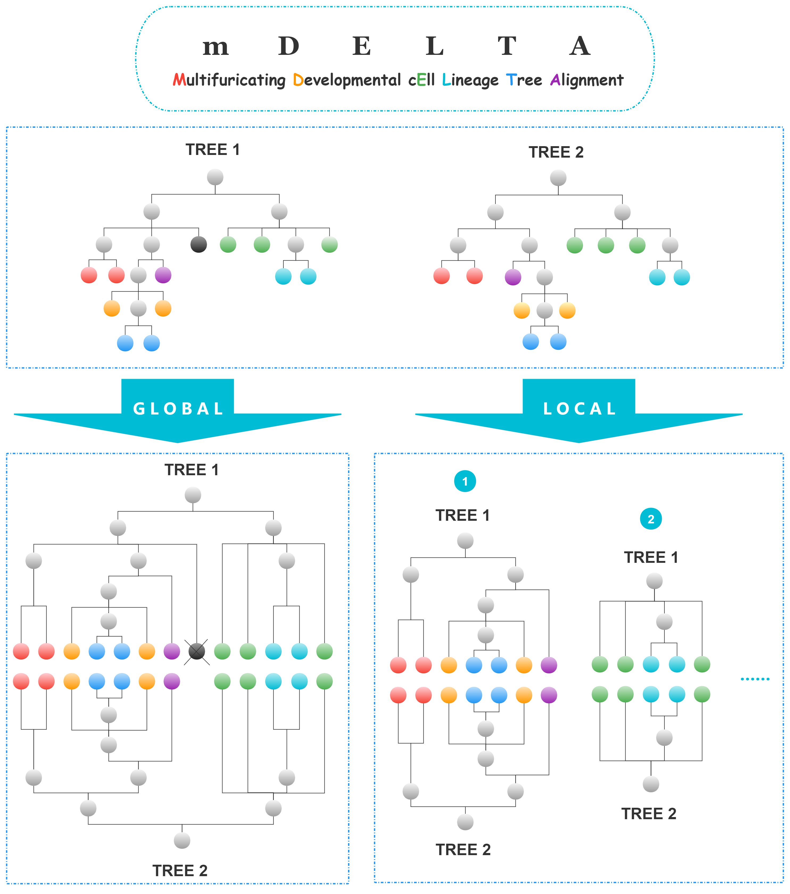
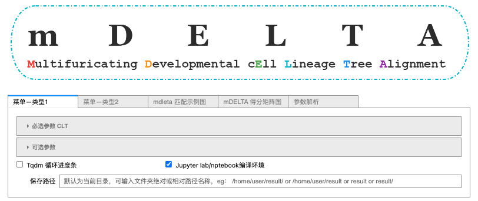
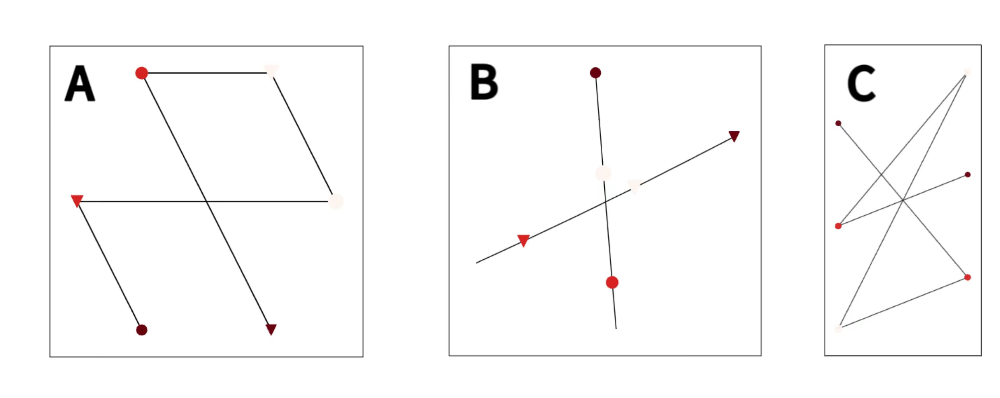
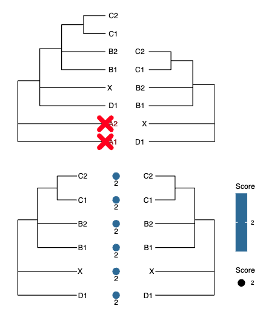
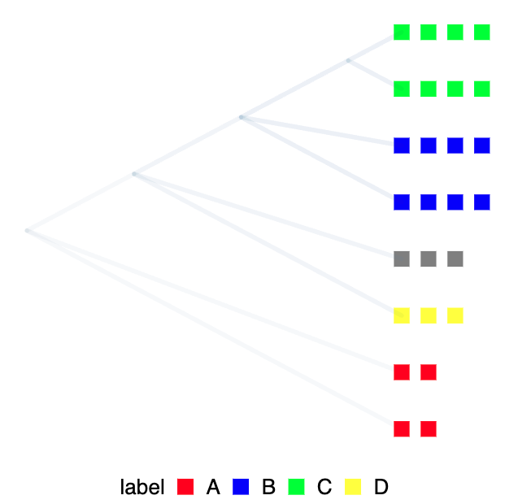
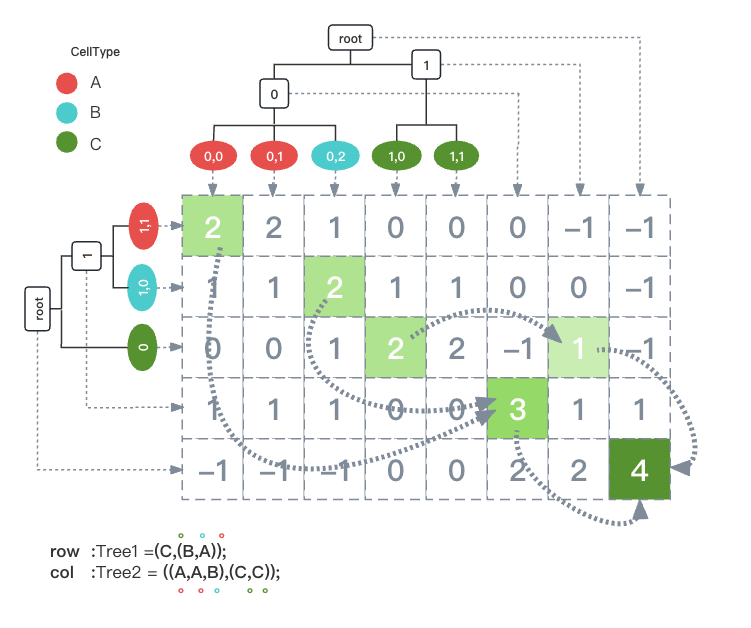

# mDELTA: an algorithm for *m*ultifuricating _D_ evelopmental c*E*ll *L*ineage *T*ree *A*lignment.

<a href="https://github.com/Chenjy0212/mdelta_full/blob/main/image/mDELTA.png"></a>

[](https://pypi.org/project/mdelta/)
[](https://jupyter.org/)
[](https://www.r-project.org/)

- **`mDELTA`** is an algorithm for **m**ultifuricating **D**evelopmental c**E**ll **L**ineage **T**ree **A**lignment. In essence, it compares two rooted, unordered, tip-labeled trees, and finds the best global ｜ local correspondence between the nodes. The **mDELTA** program is designed for analyzing developmental cell lineage trees
  reconstructed through single-cell DNA barcoding (such as done by
  **`scGESTALT`** or **`SMALT`**, while greater cellular coverage is expected to
  yield more meaningful **mDELTA** alignments).

- Except for dealing with cell lineage trees instead of biological
  sequences, **mDELTA** is conceptually similar to sequence alignment.
  It helps quantify similarity among different lineage trees,
  disentangle the consensus and variation, find recurrent motifs, and
  facilitate comparative/evolutionary analyses.

- Also included in this repository are Python/R scripts for
  statistical analyses and visualization of **mDELTA** results, which
  facilitates their biological interpretation.

- **mDELTA** was developed by Jingyu Chen (EeWhile) under the supervision of
  Professor Jian-Rong Yang at the Zhongshan School of Medicine of Sun
  Yat-Sen University in China.

For more details, please visit

> - You can try to learn about the latest examples of dynamic mDELTA running results, which will help you better understand the purpose of mDERTA ⚙️
>   <http://eewhile.cn/mdelta_ui>
> - You can obtain a separate Python package for mDELTA for further development
>   <https://github.com/Chenjy0212/mdelta>

If you have any questions, please contact me. My contact information is located at the bottom

[](https://github.com/Chenjy0212/mdelta_full)
[](https://github.com/Chenjy0212/mdelta)

# Before you begin ⚠️

1. It's best to use **jupyter** as your menu display tool, or you can install the corresponding plugin in **vscode** to use it.
2. You can install the required packages automatically by running **`mdelta_menu.ipynb`**, or you can manually run the **`package_manger.py`** to install the required packages.
   > **Tips** : The first download time may be relatively long. If any installation package fails, please go ahead and install a package that is suitable for your current running environment (Python and R)
3. You should first install stable versions of **`Python`** and **`R`** language to facilitate subsequent operations

# Quick start 💻

### Open the Munu 📖

Open jupyter and run `mdelta_menu.ipynb`, run the following code to automatically install the necessary Python packages and open the mdelta function menu.

```python
%run package_manger.py
%run ./mdelta/mydefault.py
#from mdelta.mydefault import *
myargs = get_default()
```



### Running 🚀

Select, click, and swipe to achieve automatic parameter acquisition. The relevant parameters are detailed in the "参数解析" section of the menu. Continuing to run the next section of code will obtain the desired result.

```python
%run $mdelta $TREE $TREE2 -nt $N2T -nt2 $N2T2 -xsd $XScoreFile -lsd $LScoreFile -t $top -ma $ma -mi $mi -p $p -T $Tqdm -n $notebook -mg $mgg -x $diffs -o $output -P $PERM -c $cpu
mdelta_json = output + '{}_{}_top{}_diff{}_pv{}_miv{}_mav{}_mg{}.json'.format(os.path.basename(TREE).split('.')[0], os.path.basename(TREE2).split('.')[0], top, str(diffs),  str(p), str(mi), str(ma), str(mgg))
!Rscript $match_tree $mdelta_json $XScoreFile $output $ma
%run $network $mdelta_json $output
!Rscript $densitree $mdelta_json $output
!Rscript $da $mdelta_json $output
```

<details>
<summary>show more 👈👈👈 CLICK</summary>
<pre><code>
TREE,TREE2,N2T,N2T2,XScoreFile,LScoreFile,top,mavv,mavvstep,mivv,mivvstep,ps,psstep,tqdm,n,mg,mgstep,xs,xsstep,o,PERM,cpu,mdelta,match_tree,network,densitree,da = get_listvalue(myargs.values())
output = get_output(o)
notebook, Tqdm = TF_to_10(n, tqdm)
for ma in forlist(mavv[0], mavv[1], mavvstep):
    for mi in forlist(mivv[0], mivv[1], mivvstep):
        for p in forlist(ps[0], ps[1], psstep):
            for mgg in forlist(mg[0], mg[1], mgstep):
                for diffs in forlist(xs[0], xs[1], xsstep):
                    %run $mdelta $TREE $TREE2 -nt $N2T -nt2 $N2T2 -xsd $XScoreFile -lsd $LScoreFile -t $top -ma $ma -mi $mi -p $p -T $Tqdm -n $notebook -mg $mgg -x $diffs -o $output -P $PERM -c $cpu
                    if not PERM > 0:
                        mdelta_json = output + '{}_{}_top{}_diff{}_pv{}_miv{}_mav{}_mg{}.json'.format(os.path.basename(TREE).split('.')[0], os.path.basename(TREE2).split('.')[0], top, str(diffs),  str(p), str(mi), str(ma), str(mgg))
                        !Rscript $match_tree $mdelta_json $XScoreFile $output $ma
                        %run $network $mdelta_json $output
                        !Rscript $densitree $mdelta_json $output
                        !Rscript $da $mdelta_json $output
</code></pre>
</details>

### Help 🧭

Running the following command can obtain the parsing of relevant parameters

```sh
mDELTA.py -h
```

<details>
<summary>show more 👈👈👈 CLICK</summary>
<h3>Positional arguments 👍</h1>
<table border="1">
<tr>
<th>Parameter</th> 
<th>Type</th> 
<th>Description</th>
</tr>
<td> TreeSeqFile </td>
<td> [path/filename] </td> 
<td> A text file storing cell lineage tree #1 in newick format. Tips can be labeled by name or cell type. Branch lengths should be removed. </td>
</tr>
<tr>
<td> TreeSeqFile2 </td>
<td> [path/filename] </td> 
<td> A text file storing cell lineage tree #2 in newick format. Tips can be labeled by name or cell type. Branch lengths should be removed. </td>
</tr>
</table>

<h3>Optional arguments 👌</h1>
<table border="1">
<tr>
<th>Parameter</th> 
<th>Type</th> 
<th>Description</th>
</tr>
<td> -h, --help </td>
<td></td> 
<td> show this help message and exit </td>
</tr>

<tr>
<td> -nt NAME2TYPEFILE, <br>--Name2TypeFile NAME2TYPEFILE </td>
<td> [path/filename] </td> 
<td> List of correspondance between tip name and cell type for cell lineage tree #1. </td>
</tr>

<tr>
<td> -nt2 NAME2TYPEFILE, <br>--Name2TypeFile2 NAME2TYPEFILE </td>
<td> [path/filename] </td> 
<td> List of correspondance between tip name and cell type for cell lineage tree #2. </td>
</tr>

<tr>
<td> -xsd XSCOREDICTFILE, <br>--ScoreDictFile SCOREDICTFILE </td>
<td> [path/filename] </td> 
<td> A comma-delimited text file used to
                        determine similarity scores between cells. If there
                        are exactly three columns, they will be interpreted as
                        (1) the cell (name or type) in Tree #1, (2) the cell
                        in Tree #2, and (3) the similarity score. If
                        otherwise, the first column will be interpreted as the
                        cell (name or type) and the remaining columns as
                        features of the cell (e.g. expression of a gene). The
                        similarity scores will be estimated between all pairs
                        of cells based on the Euclidean distance calculated
                        using all the features. Overrides `-ma` and `-mi`. </td>
</tr>

<tr>
<td> -lsd LSCOREDICTFILE1, <br>--ScoreDictFile1 SCOREDICTFILE1 </td>
<td> [path/filename] </td> 
<td> Calculate the Euclidean distance based on the characteristics of the cell (such as gene expression) to obtain the result x, and obtain the corresponding score through a series of operations such as - ln (x+1). </td>
</tr>

<tr>
<td> -t TOP, --top TOP </td>
<td> [int > 0] </td> 
<td> Performs local (instead of global)
                        alignment, and output the top NUM local alignments
                        with the highest score (e.g. `-t 10`). In the case of
                        global alignment, this parameter should be omitted. </td>
</tr>

<tr>
<td> -ma MAV, --mav MAV </td>
<td> [float] </td> 
<td> Default=2. Score of two paired end nodes with the same name or type.  </td>
</tr>

<tr>
<td> -mi MIV, --miv MIV </td>
<td> [float] </td> 
<td> Default=-1. Shorthand for a simple matching
                        score scheme, where the matching score between a pair
                        of the same cell types is MAV and all other pairs are
                        MIV. (e.g. `-ma 2 -mi -2`). Overridden by `-sd`. </td>
</tr>

<tr>
<td> -p PV, --pv PV  </td>
<td> [float] </td> 
<td> Default=-1. The score for pruning a tip of the tree (e.g.
                        `-p -2`). Default to -1. </td>
</tr>

<tr>
<td> -T TQDM, <tqdm>--Tqdm TQDM  </td>
<td> [0(off) or 1(on)] </td> 
<td> Whether to display the running Progress bar </td>
</tr>

<tr>
<td> -n NOTEBOOK, <br>--notebook NOTEBOOK  </td>
<td> [0(off) or 1(on)] </td> 
<td> Toggle for the jupyter notebook
                        environment. </td>
</tr>

<tr>
<td> -P PERM, --PERM PERM  </td>
<td> [int > 0] </td> 
<td> Toggle for the statistical significance. For
                        each observed alignment, the aligned trees will be
                        permuted PERM times to generate a null distribution of
                        alignment scores, with which a P value can be
                        calculated for the observed alignment score. </td>
</tr>

<tr>
<td> -c CPUS, --CPUs CPUS  </td>
<td> [int > 0] </td> 
<td> Number of threads for multi-processing.
                        Default to 50., it can reach the maximum number of
                        local CPU cores - 1. </td>
</tr>

<tr>
<td> -o OUTPUT, <br>--output OUTPUT  </td>
<td> [path] </td> 
<td> Output path, eg:'/home/username' </td>
</tr>

<tr>
<td> -mg MERGE, <br>--merge MERGE  </td>
<td> [float] </td> 
<td> This is the scaling factor for calculating the
                        score of merging an internal node (e.g. -mg -1), which
                        is multiplied by the number of tips of the internal
                        node to be merged. Default to 0. </td>
</tr>

<tr>
<td> -x DIFF, <br>--diff DIFF  </td>
<td> [int > 0] </td> 
<td> Alignment must consist of a minimal of DIFF
                        percent aligned cell pairs that are different from
                        previous(better) local alignments in order to be
                        considered as another new alignment (e.g. `-x 20`
                        means 20 percent). </td>
</tr>

</table>

<br>
<div> 
    More details on :
    <a href='https://github.com/Chenjy0212/mdelta_full' style='display: flex' target="_blank"> 
        <h1 style='color: red'>M </h1>
        <h1 style='color: orange'>D </h1>
        <h1 style='color: green'>E </h1>
        <h1 style='color: lightblue'>L </h1>
        <h1 style='color: blue'>T </h1>
        <h1 style='color: purple'>A </h1>
    </a>
</div>

</details>

# Input & Output example 🔔

### input

> **ExampleFile** 📂
>
> > [`tree1.nwk`](https://github.com/Chenjy0212/mdelta_full/tree/main/ExampleFile/tree1.nwk)  
> > [`tree2.nwk`](https://github.com/Chenjy0212/mdelta_full/tree/main/ExampleFile/tree2.nwk)
> >
> > // _Qualitative calculation_
> >
> > [`Name2Type.csv`](https://github.com/Chenjy0212/mdelta_full/tree/main/ExampleFile/Name2Type.csv)  
> > [`Xscorefile.csv`](https://github.com/Chenjy0212/mdelta_full/tree/main/ExampleFile/Xscorefile.csv)
> >
> > // _Quantitative Calculation_
> >
> > [`Lscorefile.csv`](https://github.com/Chenjy0212/mdelta_full/tree/main/ExampleFile/Lscorefile.csv)

### output

> **Output_example** 📂
>
> > [`network`](https://github.com/Chenjy0212/mdelta_full/tree/main/Output_example/network)
> >
> > > **A** -- > [`Circle.pdf`](https://github.com/Chenjy0212/mdelta_full/tree/main/Output_example/network/Circle.pdf)  
> > > **B** -- > [`Cluster.pdf`](https://github.com/Chenjy0212/mdelta_full/tree/main/Output_example/network/Cluster.pdf)  
> > > **C** -- > [`Line.pdf`](https://github.com/Chenjy0212/mdelta_full/tree/main/Output_example/network/Line.pdf)
> >
> > 
> >
> > [`Match_tree`](https://github.com/Chenjy0212/mdelta_full/tree/main/Output_example/Match_tree)
> >
> > > [`topN.pdf`](https://github.com/Chenjy0212/mdelta_full/tree/main/Output_example/Match_tree) // N represents the sequence number of the nth
> >
> > 
> >
> > [`DensitreeALL`](https://github.com/Chenjy0212/mdelta_full/tree/main/Output_example/DensitreeALL)
> >
> > > [`_densitrees_info.csv`](https://github.com/Chenjy0212/mdelta_full/tree/main/Output_example/DensitreeALL/_densitrees_info.csv)  
> > > ''' All density tree results are represented as ：
> > >
> > > 1. MatchTimes_TreeX_Label_densitree_leaves_match.csv
> > > 2. The nwk subtree sequence file of TreeX and its root node have been converted to a cell type nwk subtree sequence file '''
> >
> > [`DensitreeBEST`](https://github.com/Chenjy0212/mdelta_full/tree/main/Output_example/DensitreeBEST)
> >
> > > 1. MatchTimes_TreeX_Label_densitree_leaves_match.csv
> > > 2. The nwk subtree sequence file of TreeX and its root node have been converted to a cell type nwk subtree sequence file '''
> >
> > 

# Algorithm ⌨️



# Authors 🍊🐳❤️🍑

<ul align="center">

陈景宇 [EeWhile](http://eewhile.cn) 🤵‍♂️

Student of [SYSU](https://github.com/sysu). :school:

ZHONGSHAN SCHOOL OF MEDICINE,SYSU <https://zssom.sysu.edu.cn/zh-hans>
:sparkling_heart:

Undergraduate majoring in computer science, master majoring in
bioinformatics. :man_technologist:

Below is the contact information of the author. :eyes:

[](https://github.com/Chenjy0212)
[](https://space.bilibili.com/423592635)
[](https://www.zhihu.com/people/xing-ru-yu-yxl)
[](https://weibo.com/u/7763703673)
[![neteasy-mysic](https://img.shields.io/badge/dynamic/json?label=网易云&query=%24.data.totalSubs&url=https%3A%2F%2Fapi.spencerwoo.com%2Fsubstats%2F%3Fsource%3DneteaseMusic%26queryKey%3D596006674&color=282c34&labelColor=e72d2c&logo=data:image/svg+xml;base64,PHN2ZyBjbGFzcz0iaWNvbiIgdmlld0JveD0iMCAwIDEwMjQgMTAyNCIgeG1sbnM9Imh0dHA6Ly93d3cudzMub3JnLzIwMDAvc3ZnIiB3aWR0aD0iOTYiIGhlaWdodD0iOTYiPjxkZWZzPjxzdHlsZS8+PC9kZWZzPjxwYXRoIGQ9Ik02MjcuMDg2IDUuMTE1YzI4LjEzMi03LjY3MiA1OC44MjItNy42NzIgODYuOTUzIDAgMzMuMjQ3IDcuNjcyIDYzLjkzNyAyMy4wMTcgODkuNTEyIDQzLjQ3NyAxMC4yMyA3LjY3MyAxNy45MDIgMTUuMzQ0IDIzLjAxNyAyOC4xMzEgNy42NzIgMTcuOTAzIDUuMTE0IDM4LjM2My01LjExNSA1My43MDgtNy42NzIgMTIuNzg3LTIzLjAxNyAyMy4wMTctNDAuOTIgMjUuNTc0LTEyLjc4NyAyLjU1OC0yNS41NzQgMC0zOC4zNjItNy42NzItNS4xMTUtMi41NTgtMTAuMjMtMTAuMjMtMTcuOTAyLTEyLjc4Ny0xNy45MDItMTAuMjMtMzUuODA0LTIwLjQ2LTU2LjI2NC0xNy45MDMtMTUuMzQ1IDAtMjguMTMyIDcuNjczLTM1LjgwNCAxNy45MDMtMTAuMjMgMTAuMjMtMTIuNzg4IDIzLjAxNy0xMC4yMyAzNS44MDQgNy42NzIgMjUuNTc0IDEyLjc4NyA1My43MDYgMjAuNDYgNzkuMjgxIDUxLjE1IDIuNTU4IDk5Ljc0IDE1LjM0NSAxNDMuMjE4IDQwLjkyIDQwLjkyIDI1LjU3NSA3OS4yOCA1OC44MjEgMTA5Ljk3IDk3LjE4MyAyNS41NzUgMzMuMjQ3IDQ2LjAzNSA3MS42MSA1Ni4yNjUgMTEyLjUzIDEyLjc4NiA0My40NzYgMTcuOTAxIDg5LjUxIDEyLjc4NiAxMzIuOTg2LTIuNTU3IDM4LjM2My0xMC4yMyA3NC4xNjYtMjMuMDE2IDEwOS45NzEtMzMuMjQ3IDg0LjM5Ni05Mi4wNyAxNjEuMTItMTcxLjM1IDIwOS43MTMtNTYuMjY1IDM1LjgwMy0xMjIuNzYgNTguODIxLTE4OS4yNTMgNjYuNDkzLTQ2LjAzNCA1LjExNS05Mi4wNjkgNS4xMTUtMTM4LjEwMi0yLjU1Ny05NC42MjctMTUuMzQ1LTE4MS41OC02MS4zOC0yNTAuNjMxLTEzMC40MzEtNjYuNDk1LTY2LjQ5My0xMTIuNTMtMTUzLjQ0OC0xMzIuOTktMjQ1LjUxNi03LjY3MS02OS4wNTItNy42NzEtMTM4LjEwMyA3LjY3My0yMDcuMTU0IDE3LjkwMy04MS44NCA2MS4zOC0xNjEuMTIgMTE3LjY0NC0yMjIuNSA0OC41OTItNTEuMTUgMTA3LjQxNC04OS41MTEgMTcxLjM1LTExNy42NDMgNy42NzItMi41NTggMTIuNzg3LTUuMTE1IDIwLjQ2LTcuNjczIDE1LjM0NC0yLjU1NyAzMC42OSAwIDQzLjQ3NyAxMC4yMyAxNy45MDIgMTIuNzg4IDI1LjU3NCAzMy4yNDggMjMuMDE3IDUzLjcwNy0yLjU1NyAyMC40Ni0xNy45MDIgMzguMzYzLTM1LjgwNSA0Ni4wMzQtNjMuOTM3IDI1LjU3NS0xMjIuNzU4IDY5LjA1Mi0xNjMuNjc4IDEyMi43Ni0zOC4zNjIgNTMuNzA1LTYzLjkzNiAxMTIuNTI3LTcxLjYwOCAxNzMuOTA2LTcuNjcyIDYxLjM4IDAgMTIyLjc1OCAyMC40NiAxODEuNTggMzAuNjkgODQuMzk2IDk0LjYyNiAxNTYuMDA0IDE3My45MDcgMTk2LjkyNCA0OC41OTIgMjUuNTc1IDEwMi4yOTggMzguMzYyIDE1Ni4wMDUgMzguMzYyIDQzLjQ3NyAwIDg5LjUxMS03LjY3MiAxMzAuNDMtMjMuMDE3IDM1LjgwNS0xMi43ODcgNzEuNjEtMzMuMjQ3IDk5Ljc0MS01OC44MjIgMjguMTMzLTIzLjAxNiA1MS4xNS01My43MDYgNjYuNDk1LTg0LjM5NiA3LjY3Mi0xNS4zNDUgMTcuOTAxLTMzLjI0NyAyMC40Ni01MS4xNSAxNS4zNDQtNTEuMTQ5IDE3LjkwMS0xMDcuNDEzIDIuNTU2LTE1OC41NjEtMTIuNzg2LTQzLjQ3OC0zOC4zNjEtODEuODQtNzEuNjA5LTEwOS45NzEtMTUuMzQ0LTEyLjc4Ny0zMC42OS0yNS41NzUtNDguNTkyLTM1LjgwNS0xNS4zNDQtNy42NzItMzAuNjktMTUuMzQ1LTQ4LjU5MS0xNy45MDIgMTIuNzg4IDQ2LjAzNCAyMy4wMTggOTIuMDcgMzUuODA0IDEzNS41NDUgMi41NTggMTAuMjMgNS4xMTUgMjMuMDE4IDUuMTE1IDMzLjI0OCAyLjU1OCA0Ni4wMzMtMTUuMzQ0IDk0LjYyNS00Ni4wMzQgMTMwLjQzLTI4LjEzMiAzMy4yNDYtNjkuMDUyIDU4LjgyMS0xMTIuNTI4IDY2LjQ5NC00Ni4wMzQgMTAuMjMtOTcuMTg0IDAtMTM4LjEwMy0yNS41NzUtMzguMzYyLTI1LjU3NC02Ni40OTQtNjMuOTM2LTgxLjg0LTEwNC44NTYtNy42NzItMjMuMDE3LTEyLjc4Ny00OC41OTEtMTIuNzg3LTc0LjE2Ni0yLjU1Ni01Ni4yNjQgMTIuNzg4LTEwOS45NzEgNDMuNDc4LTE1Ni4wMDUgMzUuODA0LTUzLjcwNyA5NC42MjUtOTIuMDcgMTU4LjU2Mi0xMDkuOTcxLTUuMTE1LTE3LjkwMi0xMC4yMy0zNS44MDUtMTIuNzg3LTUzLjcwNy0xMi43ODctMzguMzYxLTEwLjIzLTgxLjgzOSA3LjY3Mi0xMTUuMDg2IDEwLjIzLTIwLjQ2IDIzLjAxOC0zOC4zNjEgNDAuOTItNTEuMTUgMjMuMDE2LTIwLjQ2IDQzLjQ3Ni0zMy4yNDYgNjYuNDk0LTQwLjkxOE00NzguNzUzIDQxOS40MjRjLTE3LjkwMyAxNy45MDItMjguMTMzIDQwLjkyLTMzLjI0NyA2My45MzYtNS4xMTQgMjAuNDYtNS4xMTQgNDMuNDc3IDAgNjYuNDk1IDUuMTE0IDIzLjAxNiAxNy45MDIgNDYuMDMzIDM4LjM2MiA2MS4zOCAxNS4zNDUgMTAuMjI4IDM1LjgwNCAxNS4zNDMgNTYuMjY0IDEwLjIyOCAzNS44MDQtNS4xMTUgNjMuOTM2LTM4LjM2MiA2My45MzYtNzQuMTY2LTIuNTU3LTcuNjcyLTIuNTU3LTE3LjkwMi01LjExNS0yNS41NzUtMTIuNzg3LTQ4LjU5Mi0yNS41NzMtOTkuNzQxLTM4LjM2MS0xNDguMzMzLTMwLjY5IDcuNjczLTU4LjgyMiAyMy4wMTgtODEuODQgNDYuMDM1eiIgZmlsbD0iI2ZmZiIvPjwvc3ZnPg==&longCache=true)](https://music.163.com/?from=infinity#/user/home?id=596006674)
[](https://www.douyin.com/user/MS4wLjABAAAA__RV747pcvcYsCF83EbCzEFLtaoKDPPr3W5NdsunjH0ly3cGnzSA8yDWMWFntYJz)
[](https://www.instagram.com/eewhile0212/)<br>
<a href="http://47.106.71.70/images/QQ.jpg">
![QQ](https://img.shields.io/badge/-1026224216-informational?logo=data:image/svg+xml;base64,PHN2ZyB4bWxucz0iaHR0cDovL3d3dy53My5vcmcvMjAwMC9zdmciIGhlaWdodD0iODAwIiB3aWR0aD0iMTIwMCIgdmlld0JveD0iLTE4LjE1IC0zNS45NzI1IDE1Ny4zIDIxNS44MzUiPjxwYXRoIGZpbGw9IiNmYWFiMDciIGQ9Ik02MC41MDMgMTQyLjIzN2MtMTIuNTMzIDAtMjQuMDM4LTQuMTk1LTMxLjQ0NS0xMC40Ni0zLjc2MiAxLjEyNC04LjU3NCAyLjkzMi0xMS42MSA1LjE3NS0yLjYgMS45MTgtMi4yNzUgMy44NzQtMS44MDcgNC42NjMgMi4wNTYgMy40NyAzNS4yNzMgMi4yMTYgNDQuODYyIDEuMTM2em0wIDBjMTIuNTM1IDAgMjQuMDM5LTQuMTk1IDMxLjQ0Ny0xMC40NiAzLjc2IDEuMTI0IDguNTczIDIuOTMyIDExLjYxIDUuMTc1IDIuNTk4IDEuOTE4IDIuMjc0IDMuODc0IDEuODA1IDQuNjYzLTIuMDU2IDMuNDctMzUuMjcyIDIuMjE2LTQ0Ljg2MiAxLjEzNnptMCAwIi8+PHBhdGggZD0iTTYwLjU3NiA2Ny4xMTljMjAuNjk4LS4xNCAzNy4yODYtNC4xNDcgNDIuOTA3LTUuNjgzIDEuMzQtLjM2NyAyLjA1Ni0xLjAyNCAyLjA1Ni0xLjAyNC4wMDUtLjE4OS4wODUtMy4zNy4wODUtNS4wMUMxMDUuNjI0IDI3Ljc2OCA5Mi41OC4wMDEgNjAuNSAwIDI4LjQyLjAwMSAxNS4zNzUgMjcuNzY5IDE1LjM3NSA1NS40MDFjMCAxLjY0Mi4wOCA0LjgyMi4wODYgNS4wMSAwIDAgLjU4My42MTUgMS42NS45MTMgNS4xOSAxLjQ0NCAyMi4wOSA1LjY1IDQzLjMxMiA1Ljc5NXptNTYuMjQ1IDIzLjAyYy0xLjI4My00LjEyOS0zLjAzNC04Ljk0NC00LjgwOC0xMy41NjggMCAwLTEuMDItLjEyNi0xLjUzNy4wMjMtMTUuOTEzIDQuNjIzLTM1LjIwMiA3LjU3LTQ5LjkgNy4zOTJoLS4xNTNjLTE0LjYxNi4xNzUtMzMuNzc0LTIuNzM3LTQ5LjYzNC03LjMxNS0uNjA2LS4xNzUtMS44MDItLjEtMS44MDItLjEtMS43NzQgNC42MjQtMy41MjUgOS40NC00LjgwOCAxMy41NjgtNi4xMTkgMTkuNjktNC4xMzYgMjcuODM4LTIuNjI3IDI4LjAyIDMuMjM5LjM5MiAxMi42MDYtMTQuODIxIDEyLjYwNi0xNC44MjEgMCAxNS40NTkgMTMuOTU3IDM5LjE5NSA0NS45MTggMzkuNDEzaC44NDhjMzEuOTYtLjIxOCA0NS45MTctMjMuOTU0IDQ1LjkxNy0zOS40MTMgMCAwIDkuMzY4IDE1LjIxMyAxMi42MDcgMTQuODIyIDEuNTA4LS4xODMgMy40OTEtOC4zMzItMi42MjctMjguMDIxIi8+PHBhdGggZmlsbD0iI2ZmZiIgZD0iTTQ5LjA4NSA0MC44MjRjLTQuMzUyLjE5Ny04LjA3LTQuNzYtOC4zMDQtMTEuMDYzLS4yMzYtNi4zMDUgMy4wOTgtMTEuNTc2IDcuNDUtMTEuNzczIDQuMzQ3LS4xOTUgOC4wNjQgNC43NiA4LjMgMTEuMDY1LjIzOCA2LjMwNi0zLjA5NyAxMS41NzctNy40NDYgMTEuNzcxbTMxLjEzMy0xMS4wNjNjLS4yMzMgNi4zMDItMy45NTEgMTEuMjYtOC4zMDMgMTEuMDYzLTQuMzUtLjE5NS03LjY4NC01LjQ2NS03LjQ0Ni0xMS43Ny4yMzYtNi4zMDUgMy45NTItMTEuMjYgOC4zLTExLjA2NiA0LjM1Mi4xOTcgNy42ODYgNS40NjggNy40NDkgMTEuNzczIi8+PHBhdGggZmlsbD0iI2ZhYWIwNyIgZD0iTTg3Ljk1MiA0OS43MjVDODYuNzkgNDcuMTUgNzUuMDc3IDQ0LjI4IDYwLjU3OCA0NC4yOGgtLjE1NmMtMTQuNSAwLTI2LjIxMiAyLjg3LTI3LjM3NSA1LjQ0NmEuODYzLjg2MyAwIDAwLS4wODUuMzY3Ljg4Ljg4IDAgMDAuMTYuNDk2Yy45OCAxLjQyNyAxMy45ODUgOC40ODcgMjcuMyA4LjQ4N2guMTU2YzEzLjMxNCAwIDI2LjMxOS03LjA1OCAyNy4yOTktOC40ODdhLjg3My44NzMgMCAwMC4xNi0uNDk4Ljg1Ni44NTYgMCAwMC0uMDg1LS4zNjUiLz48cGF0aCBkPSJNNTQuNDM0IDI5Ljg1NGMuMTk5IDIuNDktMS4xNjcgNC43MDItMy4wNDYgNC45NDMtMS44ODMuMjQyLTMuNTY4LTEuNTgtMy43NjgtNC4wNy0uMTk3LTIuNDkyIDEuMTY3LTQuNzA0IDMuMDQzLTQuOTQ0IDEuODg2LS4yNDQgMy41NzQgMS41OCAzLjc3MSA0LjA3bTExLjk1Ni44MzNjLjM4NS0uNjg5IDMuMDA0LTQuMzEyIDguNDI3LTIuOTkzIDEuNDI1LjM0NyAyLjA4NC44NTcgMi4yMjMgMS4wNTcuMjA1LjI5Ni4yNjIuNzE4LjA1MyAxLjI4Ni0uNDEyIDEuMTI2LTEuMjYzIDEuMDk1LTEuNzM0Ljg3NS0uMzA1LS4xNDItNC4wODItMi42Ni03LjU2MiAxLjA5Ny0uMjQuMjU3LS42NjguMzQ2LTEuMDczLjA0LS40MDctLjMwOC0uNTc0LS45My0uMzM0LTEuMzYyIi8+PHBhdGggZmlsbD0iI2ZmZiIgZD0iTTYwLjU3NiA4My4wOGgtLjE1M2MtOS45OTYuMTItMjIuMTE2LTEuMjA0LTMzLjg1NC0zLjUxOC0xLjAwNCA1LjgxOC0xLjYxIDEzLjEzMi0xLjA5IDIxLjg1MyAxLjMxNiAyMi4wNDMgMTQuNDA3IDM1LjkgMzQuNjE0IDM2LjFoLjgyYzIwLjIwOC0uMiAzMy4yOTgtMTQuMDU3IDM0LjYxNi0zNi4xLjUyLTguNzIzLS4wODctMTYuMDM1LTEuMDkyLTIxLjg1NC0xMS43MzkgMi4zMTUtMjMuODYyIDMuNjQtMzMuODYgMy41MTgiLz48cGF0aCBmaWxsPSIjZWIxOTIzIiBkPSJNMzIuMTAyIDgxLjIzNXYyMS42OTNzOS45MzcgMi4wMDQgMTkuODkzLjYxNlY4My41MzVjLTYuMzA3LS4zNTctMTMuMTA5LTEuMTUyLTE5Ljg5My0yLjMiLz48cGF0aCBmaWxsPSIjZWIxOTIzIiBkPSJNMTA1LjUzOSA2MC40MTJzLTE5LjMzIDYuMTAyLTQ0Ljk2MyA2LjI3NWgtLjE1M2MtMjUuNTkxLS4xNzItNDQuODk2LTYuMjU1LTQ0Ljk2Mi02LjI3NUw4Ljk4NyA3Ni41N2MxNi4xOTMgNC44ODIgMzYuMjYxIDguMDI4IDUxLjQzNiA3Ljg0NWguMTUzYzE1LjE3NS4xODMgMzUuMjQyLTIuOTYzIDUxLjQzNy03Ljg0NXptMCAwIi8+PC9zdmc+)
</a>
<a href="http://47.106.71.70/images/WeChat.jpg">
</a>
[![mail](https://img.shields.io/badge/QQmail-1026224216@qq.com-blue?logo=data:image/svg+xml;base64,PHN2ZyBpZD0iTGF5ZXJfMSIgZGF0YS1uYW1lPSJMYXllciAxIiB4bWxucz0iaHR0cDovL3d3dy53My5vcmcvMjAwMC9zdmciIHZpZXdCb3g9IjAgMCAxMjIuODggOTAuNTQiPjxkZWZzPjxzdHlsZT4uY2xzLTF7ZmlsbDojMmIzMzQ0O30uY2xzLTJ7ZmlsbDojZmUwMDAwO2ZpbGwtcnVsZTpldmVub2RkO30uY2xzLTN7ZmlsbDojZmZmO308L3N0eWxlPjwvZGVmcz48dGl0bGU+bmV3LW1haWw8L3RpdGxlPjxwYXRoIGNsYXNzPSJjbHMtMSIgZD0iTTAsODcuMjQsMzQuNTEsNTIuMTgsMCwyMy42N1Y4Ny4yNFptMy42NC02Ni45TDUxLjgxLDU5bDE3LjkyLTE1YTMyLjc0LDMyLjc0LDAsMCwxLTUtMjMuNlpNMzguODMsNTUuNzksMy43LDkwLjU0SDk3Ljg3TDY0LjM0LDU1LjgsNTMuNDUsNjUuNDdoMGEyLjQ2LDIuNDYsMCwwLDEtMy4xNywwTDM4LjgzLDU1Ljc5Wm0yOS43NS0zLjY4LDMzLjI5LDM1LjQxVjU4LjI4QTMyLjgyLDMyLjgyLDAsMCwxLDczLjEsNDguMjFsLTQuNTIsMy45WiIvPjxwYXRoIGNsYXNzPSJjbHMtMiIgZD0iTTk3LjA5LDBhMjUuOCwyNS44LDAsMSwxLTI1LjgsMjUuNzlBMjUuNzksMjUuNzksMCwwLDEsOTcuMDksMFoiLz48cGF0aCBjbGFzcz0iY2xzLTMiIGQ9Ik05My44MywzMS4zNlYyMC4yN2E3LjI5LDcuMjksMCwwLDEtNC42LDIuMzFWMTYuMjljMi4xLS4yLDQuODYtMS40OCw2LTMuMzVoNi4wOFYzMS4zNkgxMDV2NS43SDkwdi01LjdaIi8+PC9zdmc+&labelColor=white)](https://mail.qq.com)
[](https://mail.google.com/mail)<br>
[![sysu](https://img.shields.io/badge/%20SYSU-系统与进化基因组学实验室-black?logo=data:image/svg+xml;base64,PD94bWwgdmVyc2lvbj0iMS4wIiBlbmNvZGluZz0idXRmLTgiPz48c3ZnIHZlcnNpb249IjEuMSIgaWQ9IkxheWVyXzEiIHhtbG5zPSJodHRwOi8vd3d3LnczLm9yZy8yMDAwL3N2ZyIgeG1sbnM6eGxpbms9Imh0dHA6Ly93d3cudzMub3JnLzE5OTkveGxpbmsiIHg9IjBweCIgeT0iMHB4IiB2aWV3Qm94PSIwIDAgMTAyLjM0IDEyMi44OCIgc3R5bGU9ImVuYWJsZS1iYWNrZ3JvdW5kOm5ldyAwIDAgMTAyLjM0IDEyMi44OCIgeG1sOnNwYWNlPSJwcmVzZXJ2ZSI+PHN0eWxlIHR5cGU9InRleHQvY3NzIj48IVtDREFUQVsNCgkuc3Qwe2ZpbGwtcnVsZTpldmVub2RkO2NsaXAtcnVsZTpldmVub2RkO30NCl1dPjwvc3R5bGU+PGc+PHBhdGggY2xhc3M9InN0MCIgZD0iTTUzLjM2LDMuMzFjOC43LTYuMDEsOS4zNSw1Ljg5LDE3Ljg5LTEuNTVWMTMuOWMtOC4xNCw3LjMzLTkuOS00LjUxLTE3Ljg5LDEuNVYzLjMxTDUzLjM2LDMuMzFMNTMuMzYsMy4zMXogTTQ5LjQ1LDM3LjAxaDEuNTJjMC4yOCwwLDAuNSwwLjIzLDAuNSwwLjV2NS44NGg1LjMzYzAuMjgsMCwwLjUsMC4yMywwLjUsMC41djEuNTJjMCwwLjI4LTAuMjMsMC41LTAuNSwwLjVoLTcuODZ2LTguMzcgQzQ4Ljk0LDM3LjI0LDQ5LjE3LDM3LjAxLDQ5LjQ1LDM3LjAxTDQ5LjQ1LDM3LjAxTDQ5LjQ1LDM3LjAxeiBNNTEuMTcsMzAuMTdjNi44NSwwLDEyLjQsNS41NSwxMi40LDEyLjQgYzAsNi44NS01LjU1LDEyLjQtMTIuNCwxMi40Yy02Ljg1LDAtMTIuNC01LjU1LTEyLjQtMTIuNEMzOC43NywzNS43Myw0NC4zMiwzMC4xNyw1MS4xNywzMC4xN0w1MS4xNywzMC4xN0w1MS4xNywzMC4xN3ogTTUyLjg3LDcxLjc0djQwLjI3aDEyLjI1VjcxLjc0SDUyLjg3TDUyLjg3LDcxLjc0eiBNNDkuNDcsMTEyLjAxVjcxLjc0SDM3LjIybDAsMHY0MC4yN0g0OS40N0w0OS40NywxMTIuMDF6IE0xMDIuMzQsMTIyLjg1IFY1MS44Nkg3NS4zOFYzNC42N0w1Mi4xMywxOS42OVYzLjA5aC0wLjA4YzAuNDktMC4yOCwwLjgxLTAuODIsMC44MS0xLjQzYzAtMC45Mi0wLjc0LTEuNjYtMS42Ni0xLjY2cy0xLjY2LDAuNzQtMS42NiwxLjY2IGMwLDAuNjEsMC4zMywxLjE0LDAuODEsMS40M2gtMC4wOHYxNi41N2wtMjMuMywxNS4wMXYxNy4xOUg3LjIzSDB2NzEuMDJDMzQuMTIsMTIyLjg4LDY4LjIyLDEyMi44NSwxMDIuMzQsMTIyLjg1TDEwMi4zNCwxMjIuODUgTDEwMi4zNCwxMjIuODV6IE0xMC45OSw3MS43NGgxMy40OXY1LjI1SDEwLjk5VjcxLjc0TDEwLjk5LDcxLjc0TDEwLjk5LDcxLjc0eiBNNzcuODUsNzEuNzRoMTMuNDl2NS4yNUg3Ny44NVY3MS43NEw3Ny44NSw3MS43NCBMNzcuODUsNzEuNzR6IE0xMC45OSw4My4zM2gxMy40OXY1LjI1SDEwLjk5VjgzLjMzTDEwLjk5LDgzLjMzTDEwLjk5LDgzLjMzeiBNNzcuODUsODMuMzNoMTMuNDl2NS4yNUg3Ny44NVY4My4zM0w3Ny44NSw4My4zMyBMNzcuODUsODMuMzN6IE0xMC45OSw5NC45MmgxMy40OXY1LjI1SDEwLjk5Vjk0LjkyTDEwLjk5LDk0LjkyTDEwLjk5LDk0LjkyeiBNNzcuODUsOTQuOTJoMTMuNDl2NS4yNUg3Ny44NVY5NC45Mkw3Ny44NSw5NC45MiBMNzcuODUsOTQuOTJ6IE0xMC45OSwxMDYuNTFoMTMuNDl2NS4yNUgxMC45OVYxMDYuNTFMMTAuOTksMTA2LjUxTDEwLjk5LDEwNi41MXogTTc3Ljg1LDEwNi41MWgxMy40OXY1LjI1SDc3Ljg1VjEwNi41MSBMNzcuODUsMTA2LjUxTDc3Ljg1LDEwNi41MXoiLz48L2c+PC9zdmc+&labelColor=darkgreen)](https://www.labxing.com/lab/719/members)


</ul>

If you use this project in your research, please cite this project.

```latex
@misc{mdelta2022,
    author = {Jingyu Chen},
    title = {mDELTA: Multifuricating Developmental cEll Lineage Tree Alignment},
    year = {2023},
    publisher = {GitHub},
    journal = {GitHub repository},
    howpublished = {\url{https://github.com/Chenjy0212/mdelta_full}},
}
```
